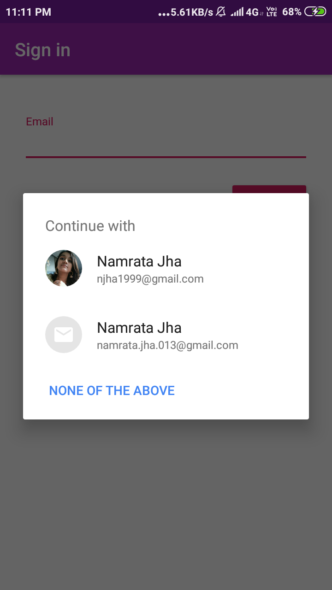
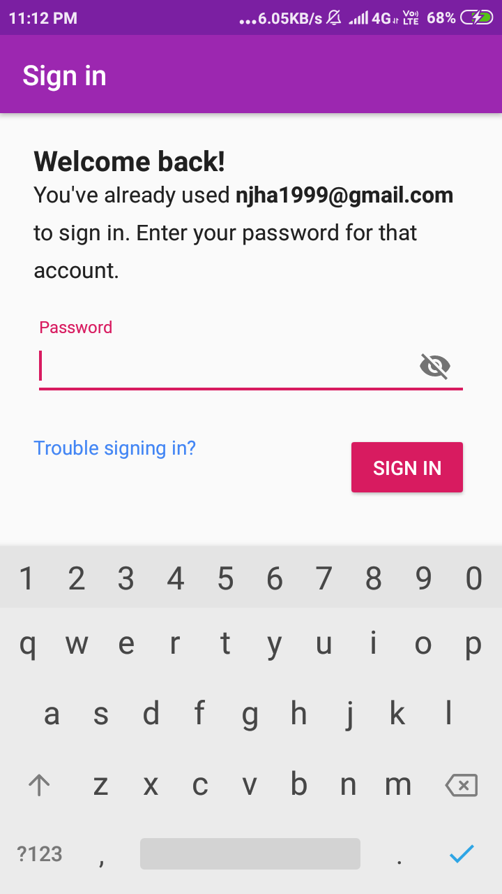
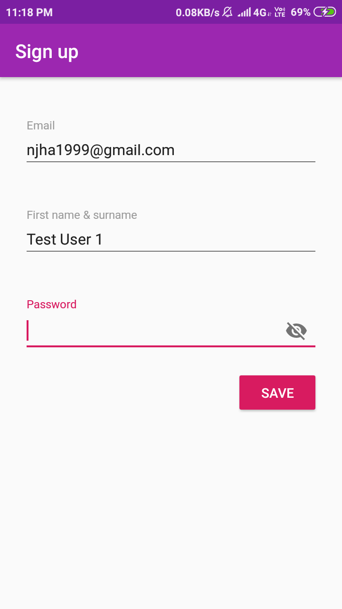
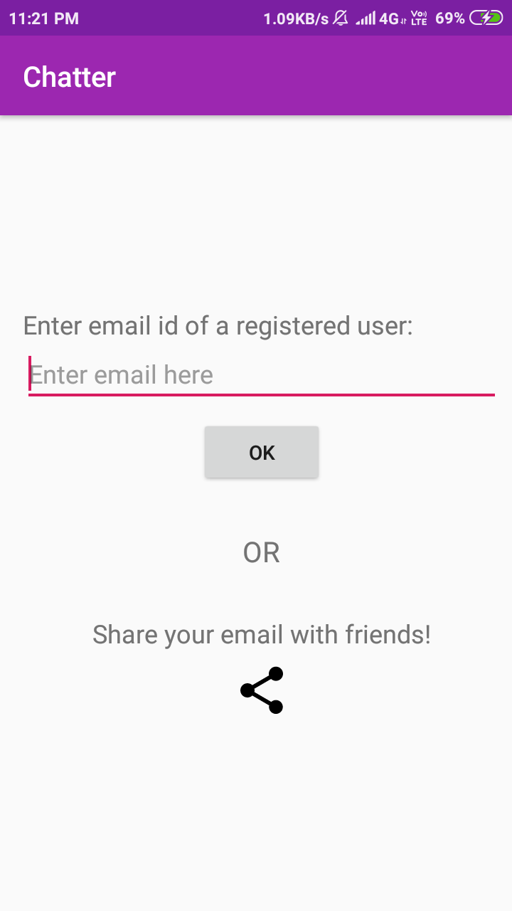
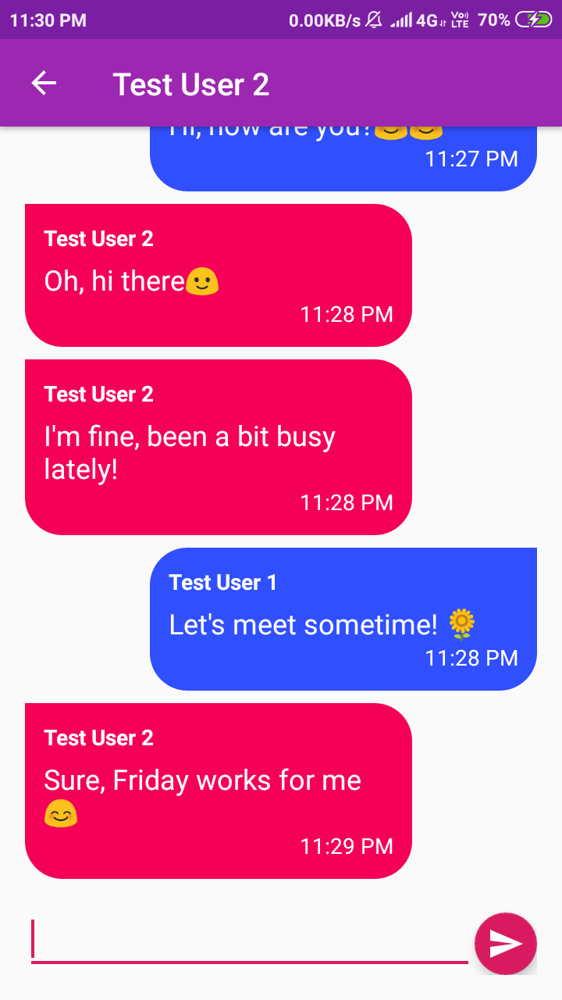
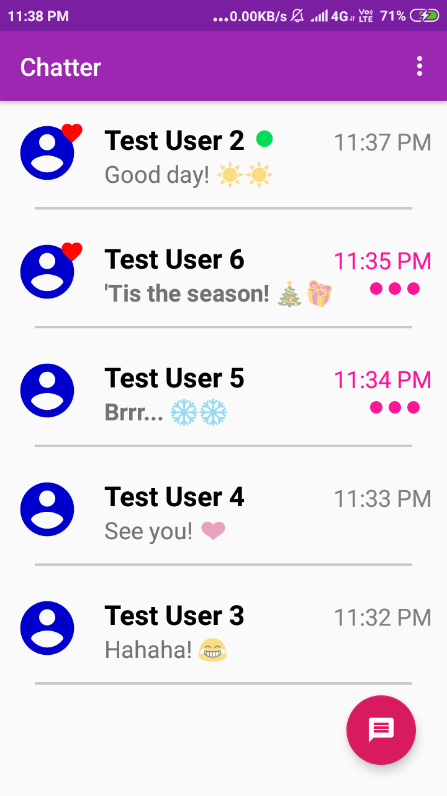
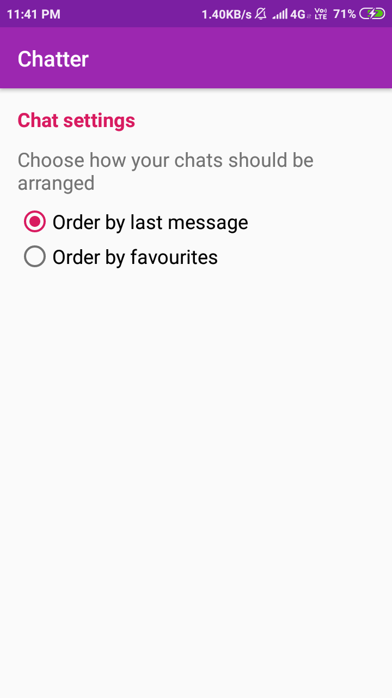

# Chatter
An Android chat application which lets users have a conversation with Chatter users by either entering their registered email ID or sharing your ID with other Chatter users.
The messages are stored and retrieved using the Firebase Real-time database, and the sign-in is supported by Firebase Authentication services.

## Login options
 

###### 1. Using Google account
 

                   

 

###### 2. Using email
 

  

 

## Starting a new chat
 

 

## Chat Room
 

 

## List of chats
 

 

## Application Settings
 

 
